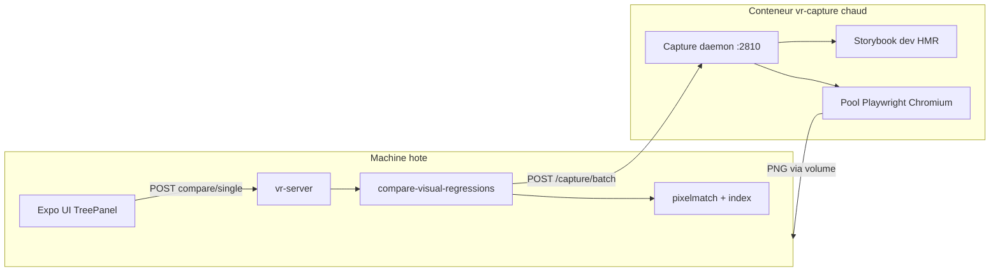

# Plan : Dockerisation obligatoire de toutes les captures VR

## Objectif

**Toute capture de screenshot** (compare globale, compare initiale, TreePanel `/compare/single`, benchmarks…) doit s'exécuter dans un environnement Linux figé. Aucun fallback Playwright local sur l'hôte.

L'UI Expo et le serveur VR restent en local ; seuls Storybook (pour capture) et Playwright tournent dans Docker.



## Principe d'architecture

| Couche                        | Responsabilité                                                                    |
| ----------------------------- | --------------------------------------------------------------------------------- |
| Sidecar Docker (`vr-capture`) | Storybook + daemon HTTP + Playwright (session chaude)                             |
| Hôte                          | vr-server, UI Expo, logique incrémentale, pixelmatch, index                       |
| Point d'interception          | `runCaptureBatch` dans [`vr-capture-engine.ts`](src/scripts/vr-capture-engine.ts) |
| Volume `vr_node_modules`      | `node_modules` Linux (évite binaires Mac/Windows incompatibles)                   |

**Pourquoi sidecar persistant (pas `docker run` par capture) :**

- TreePanel : ~1–3s par story (pool Playwright chaud)
- `docker run` one-shot : ~10–30s de cold start par clic — inacceptable en dev
- Storybook dev + HMR : changements de stories/composants pris en compte sans rebuild static

---

## 1. Variable de contrôle et politique stricte

Nouvelles variables :

| Variable                | Défaut                              | Rôle                                                                             |
| ----------------------- | ----------------------------------- | -------------------------------------------------------------------------------- |
| `VR_CAPTURE_BACKEND`    | `docker`                            | `docker` = capture remote obligatoire ; `local` = réservé tests internes package |
| `VR_CAPTURE_DAEMON_URL` | `http://localhost:2810`             | URL du daemon dans le sidecar                                                    |
| `VR_STORYBOOK_MODE`     | `dev` (session) / `static` (CI)     | Mode Storybook dans le conteneur                                                 |
| `VR_DOCKER_IMAGE`       | `ghcr.io/setshao/vr-capture:1.61.1` | Image sidecar                                                                    |
| `VR_DOCKER=1`           | auto dans conteneur                 | Flags Chromium déterministes                                                     |

Si `VR_CAPTURE_BACKEND=docker` et daemon injoignable → **erreur explicite**, pas de capture locale silencieuse.

---

## 2. Daemon de capture (cœur du sidecar)

Nouveau fichier : [`src/scripts/vr-capture-daemon.ts`](src/scripts/vr-capture-daemon.ts)

Responsabilités :

1. Install deps si lockfile changé (voir §5)
2. Démarrer Storybook selon `VR_STORYBOOK_MODE` :
   - **dev** : `storybook dev -p 6006` (HMR, code monté en volume)
   - **static** : build + `serve storybook-static` (CI)
3. Exposer API HTTP :
   - `GET /health` — Storybook prêt + browser pool initialisé
   - `POST /capture/batch` — body `{ tasks, options }` → exécute `runCaptureBatch` **en interne** (mode `VR_CAPTURE_BACKEND=local` dans le conteneur uniquement)
4. Écriture des PNG sur le volume monté (`/work`)

Le daemon garde le pool Playwright et les contextes device en vie entre les requêtes (réutilise la logique existante de [`vr-capture-engine.ts`](src/scripts/vr-capture-engine.ts)).

---

## 3. Interception centralisée côté hôte

Fichier : [`src/scripts/vr-capture-engine.ts`](src/scripts/vr-capture-engine.ts)

```ts
export const runCaptureBatch = async (tasks, options) => {
  if (isDockerCaptureBackend()) {
    return runCaptureBatchRemote(tasks, options); // fetch POST /capture/batch
  }
  if (isDockerCaptureRequired()) {
    throw new Error("VR_CAPTURE_BACKEND=docker mais daemon injoignable …");
  }
  // chemin local : tests internes uniquement
};
```

Nouveau module : [`src/utils/vr-capture-remote.ts`](src/utils/vr-capture-remote.ts)

- `waitForCaptureDaemon(maxAttempts)`
- `runCaptureBatchRemote(tasks, options)` — sérialise tasks, attend réponse, retourne `CaptureBatchResult`

**Tous les appels existants** passent automatiquement par Docker sans modification :

- [`compare-visual-regressions.ts`](src/scripts/compare-visual-regressions.ts) (`compare`, `compareSingleStory`, `compareSelectedStories`, `compareAllStories`)
- [`vr-server.ts`](src/scripts/vr-server.ts) endpoints `/compare/single`, `/compare/selected`, etc.
- [`vr-launcher.ts`](src/scripts/vr-launcher.ts) compare initiale
- benchmarks (`vr-benchmark-*.ts`)

La comparaison pixelmatch peut rester côté hôte (lecture des fichiers sur volume) ou être déplacée dans le daemon en phase 2 — v1 : captures dans Docker, compare fichiers sur hôte (inchangé).

---

## 4. Durcir le rendu Chromium

Fichier : [`src/scripts/vr-capture-engine.ts`](src/scripts/vr-capture-engine.ts)

Extraire `CHROMIUM_DETERMINISTIC_ARGS` appliqués quand `VR_DOCKER=1` ou `process.platform === 'linux'` :

```ts
("--no-sandbox",
  "--disable-dev-shm-usage",
  "--disable-gpu",
  "--force-color-profile=srgb",
  "--font-render-hinting=none",
  "--disable-lcd-text");
```

Interdire Edge/Chrome système en Docker — Chromium bundlé Playwright uniquement.

---

## 5. Docker : image, compose, volumes

Nouveau dossier : `docker/`

| Fichier                                                  | Rôle                                              |
| -------------------------------------------------------- | ------------------------------------------------- |
| [`docker/Dockerfile`](docker/Dockerfile)                 | `FROM mcr.microsoft.com/playwright:v1.61.1-jammy` |
| [`docker/docker-compose.yml`](docker/docker-compose.yml) | Service `vr-capture` avec ports et volumes        |
| [`docker/entrypoint.sh`](docker/entrypoint.sh)           | Install conditionnel + lance daemon               |

**`docker-compose.yml` (performant) :**

```yaml
services:
  vr-capture:
    image: ghcr.io/setshao/vr-capture:1.61.1
    volumes:
      - ..:/work # code hôte (bind mount)
      - vr_node_modules:/work/node_modules # Linux binaries (écrase node_modules hôte)
    ports:
      - "6006:6006" # Storybook (preview manuelle)
      - "2810:2810" # Capture daemon
    environment:
      VR_DOCKER: "1"
      VR_PROJECT_ROOT: /work
      VR_CAPTURE_BACKEND: local
      VR_STORYBOOK_MODE: dev
    working_dir: /work
```

**Install performante** (`entrypoint.sh`) :

- Détecter gestionnaire via lockfile (yarn/npm/pnpm)
- Skip si `.vr-cache/docker-deps.hash` == hash lockfile
- Sinon install dans le volume `vr_node_modules`

**Ne pas** COPY le code hôte dans l'image.

---

## 6. Intégration launcher

Fichier : [`src/scripts/vr-launcher.ts`](src/scripts/vr-launcher.ts)

Nouvel ordre de démarrage :

1. `docker compose -f node_modules/@setshao/visual-regression/docker/docker-compose.yml up -d`
2. Attendre `GET /health` sur `VR_CAPTURE_DAEMON_URL`
3. Démarrer vr-server (hôte)
4. Compare initiale → `runCaptureBatch` → daemon Docker (automatique)
5. Démarrer Expo UI (hôte)

**Supprimer** le lancement Storybook local sur l'hôte (port 6006 forwardé depuis le conteneur).

À l'arrêt (`SIGINT`/`SIGTERM`) : `docker compose down`.

Nouveau util : [`src/utils/vr-storybook-runtime.ts`](src/utils/vr-storybook-runtime.ts)

- Extraire logique Storybook dev/static de vr-launcher
- Réutilisé par le daemon et documenté pour Docker maison

---

## 7. CLI et scripts

Fichier : [`bin/visual-regression.mjs`](bin/visual-regression.mjs)

Nouvelles sous-commandes :

- `capture-up` — démarre le sidecar + healthcheck
- `capture-down` — arrête le sidecar
- `capture-status` — health + version image

Scripts [`package.json`](package.json) :

```json
"vr:capture:up": "node bin/visual-regression.mjs capture-up",
"vr:capture:down": "node bin/visual-regression.mjs capture-down"
```

`yarn vr:compare` n'a plus besoin d'un flux séparé : le daemon doit être up (démarré par `yarn vr` ou `vr:capture:up`).

---

## 8. CI (mode static, one-shot ou shardé)

Même image, mais `VR_STORYBOOK_MODE=static` :

1. Build `storybook-static` une fois
2. `serve` + captures
3. Conteneur s'arrête en fin de job

Exemple : [`docker/ci/github-actions.example.yml`](docker/ci/github-actions.example.yml)

```yaml
- uses: actions/checkout@v4
  with: { fetch-depth: 0 }
- run: docker compose -f docker/docker-compose.ci.yml run --rm vr-capture \
    sh -c "yarn vr:compare"
  env:
    VR_STORYBOOK_MODE: static
    VR_COMPARE_MODE: incremental
```

Cache CI : volume `vr_node_modules` + `storybook-static/` via `actions/cache`.
Sharding : `VR_SHARD_INDEX` / `VR_SHARD_TOTAL` sur N jobs parallèles.

---

## 9. Publication GHCR

Workflow : [`.github/workflows/docker-publish.yml`](.github/workflows/docker-publish.yml)

- Image : `ghcr.io/setshao/vr-capture`
- Tags alignés sur version Playwright (`1.61.1`)
- v1 : `linux/amd64` uniquement (arm64 phase 2)

Mettre à jour `files` dans [`package.json`](package.json) : inclure `docker/`.

---

## 10. Documentation et contrat Docker maison

Section README :

- **Prérequis** : Docker installé, script `storybook:build:stats` côté hôte
- **Dev** : `yarn vr` démarre automatiquement le sidecar
- **Toute capture = Docker** : TreePanel, compare globale, CI
- **Storybook à jour** : HMR via Storybook dev dans le conteneur
- **Docker maison** : respecter le contrat (image Playwright, daemon HTTP, volume `node_modules` Linux, `VR_DOCKER=1`)

---

## 11. Validation

Étendre [`src/scripts/vr-test-validation.ts`](src/scripts/vr-test-validation.ts) :

- Présence `docker/Dockerfile`, `docker-compose.yml`, daemon
- Version Playwright Dockerfile == `package.json`
- `VR_CAPTURE_BACKEND=docker` refuse capture si daemon down
- `capture-status` dry-run
- Test manuel : modifier une story → régénérer via TreePanel → vérifier capture via daemon (logs conteneur)

---

## Hors scope (itération 1)

- Dockeriser Expo UI
- Multi-arch `linux/arm64`
- Modifier codes de sortie `compare` sur diffs
- Déplacer pixelmatch dans le daemon (option phase 2)

---

## Ordre d'implémentation

1. Flags Chromium déterministes
2. `vr-storybook-runtime.ts` (util Storybook dev/static)
3. `vr-capture-daemon.ts` (API + Playwright interne)
4. `vr-capture-remote.ts` + interception `runCaptureBatch`
5. `docker/Dockerfile` + `docker-compose.yml` + `entrypoint.sh`
6. Intégration `vr-launcher.ts` (up/down sidecar, plus de SB local)
7. CLI `capture-up` / `capture-down` / `capture-status`
8. README + exemple CI
9. Workflow GHCR
10. Validation
