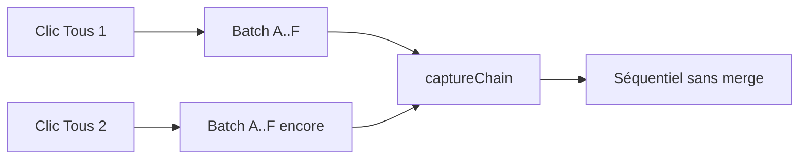
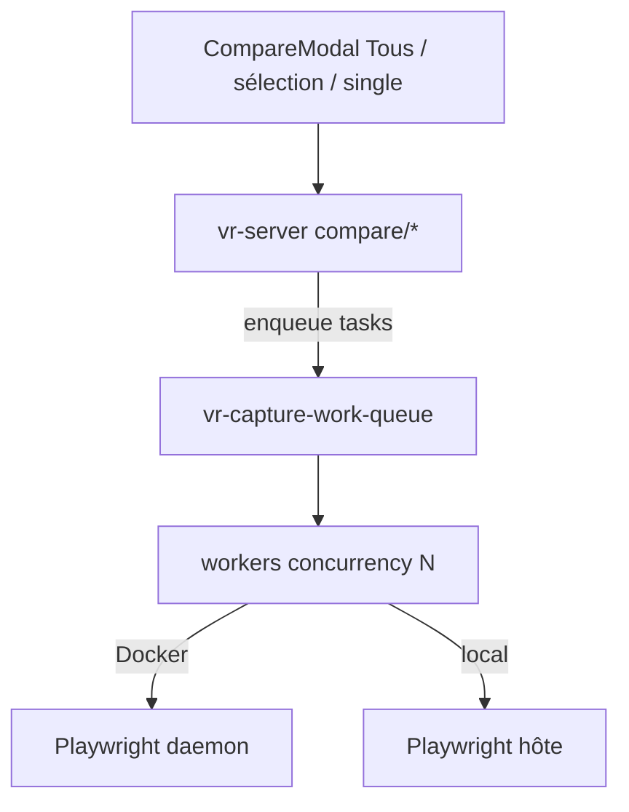

# File d’attente de capture VR (fusion / dédup)

> **Statut : reporté (2026-07-17).** Une première implémentation a été faite puis revertée. Reprendre ce plan tel quel quand on voudra livrer la feature.

## Contrainte perf (à respecter à l’implémentation)

- Workers concurrents (`concurrency` / `concurrencyDev`) qui tirent depuis `pending`
- Browser Playwright **partagé** (pas 1 browser / tâche)
- **Pas** de sérialisation HTTP 1 tâche = 1 `POST /capture/batch` via `captureChain`
- 1 régénération « Tous » idle ≈ durée actuelle

## Problème actuel

Un clic sur **Tous** (`POST /compare/all-stories`) appelle [`compareAllStories`](../src/scripts/compare-visual-regressions.ts) → `runCaptureBatch` et **attend** la fin. Un second clic part en parallèle ; côté Docker, le daemon ne fait que sérialiser via `captureChain` ([`vr-capture-daemon.ts`](../src/scripts/vr-capture-daemon.ts)) → **deux batches complets** l’un après l’autre. Aucune fusion de tâches.

## Comportement cible (règles métier)

Clé de tâche : `deviceName + storyId` (et `componentDir` porté par la tâche).

| Situation                                                 | Action                                                  |
| --------------------------------------------------------- | ------------------------------------------------------- |
| Déjà dans la file (pas encore capturée)                   | **ne pas dupliquer**                                    |
| Déjà capturée (dans cette session de drain) et redemandée | **re-enqueue** (recapture)                              |
| En cours de capture et redemandée                         | marquer **recapture après** la fin de la tâche courante |
| Nouvelle                                                  | **ajouter** en queue                                    |
| En queue / en cours, non redemandée                       | **laisser**                                             |

Exemple : file `A..F`, `A`/`B` faits, reste `C..F` ; nouvelle demande `A,C,E,G` → suite : `A` (recapture en tête), `C,D,E,F`, `G` (une seule fois pour `C`/`E`).

## Où placer la file

**Dans le process qui exécute Playwright** (seul endroit où on connaît vraiment « capturé / en cours / pending ») :

- Backend **docker** → singleton dans le **daemon** ([`vr-capture-daemon.ts`](../src/scripts/vr-capture-daemon.ts))
- Backend **local** → même module, singleton dans le process hôte qui capture ([`vr-server`](../src/scripts/vr-server.ts) via le moteur)

Nouveau module : [`src/utils/vr-capture-work-queue.ts`](../src/utils/vr-capture-work-queue.ts)

Périmètre : **régénérations UI** (`/compare/single`, `/by-type`, `/all-stories`, `/selected`). La compare initiale CLI (`compare-visual-regressions` spawn) reste hors file pour cette itération (process séparé).

## Implémentation

### 1. Module file (`vr-capture-work-queue.ts`)

- Structures : `pending` (Map ordonnée), `inFlight`, `completedThisRun`, flag `recaptureAfter` sur in-flight
- `enqueue(tasks): { enqueued, deduped, recapture }` — applique les règles ci-dessus
- `startWorkers(concurrency, captureOne)` — N workers tirent depuis `pending` (plus de batch figé)
- `waitForKeys(keys)` — pour que le HTTP attende que **les tâches de cette requête** soient terminées (pas forcément toute la file globale)
- Quand file vide et plus d’in-flight → reset `completedThisRun`
- Recapture d’une tâche completed → **prepend** en tête de `pending`

### 2. Moteur / daemon

- Extraire la capture **d’une** tâche depuis [`vr-capture-engine.ts`](../src/scripts/vr-capture-engine.ts) → `captureOneTask(...)`
- Daemon : remplacer `runSerialized(runCaptureBatch)` par `enqueue` + workers ; garder `POST /capture/batch` comme **enqueue + waitForKeys** (rétrocompat)
- Host Docker ([`vr-capture-remote.ts`](../src/utils/vr-capture-remote.ts)) : chemin URL inchangé, sémantique merge côté daemon
- Local : `runCaptureBatch` utilise la même file dans le process local

### 3. Serveur + wipe « Tous »

Dans [`compareAllStories`](../src/scripts/compare-visual-regressions.ts) / handlers [`vr-server.ts`](../src/scripts/vr-server.ts) :

- **Wipe global** (`deleteAll…`) **uniquement si la file est idle** au moment du enqueue
- Si la file tourne déjà : **pas de wipe global** ; chaque tâche utilise `clearScreenshotsBeforeCapture`
- Tous les endpoints compare UI → `enqueue` plutôt que deux `runCaptureBatch` indépendants

### 4. UI (minimal)

- Brancher `loading` sur [`CompareModal`](../src/components/CompareModal.tsx) depuis [`VisualRegressions.tsx`](../src/VisualRegressions.tsx)
- Source de vérité = serveur/daemon ; le disable n’empêche pas deux clients, la file oui

### 5. Tests

- Unit tests sur `enqueue` : dédup pending, recapture après completed, flag in-flight, ordre
- Petit test d’intégration : enqueue A..F, marquer A/B completed, enqueue A,C,E,G → pending attendu

## Fichiers principaux

- **Nouveau** : `src/utils/vr-capture-work-queue.ts` (+ `.test.ts`)
- **Modifs** : `vr-capture-engine.ts`, `vr-capture-daemon.ts`, `vr-capture-remote.ts`, `compare-visual-regressions.ts`, `vr-server.ts`, `CompareModal` / `VisualRegressions` (loading)
- **Doc** : courte note dans le README (file merge, wipe idle-only)

## Hors scope

- Fusion avec la compare initiale `yarn vr` / `vr:compare` (autre process)
- Annulation explicite de tâches déjà en file
