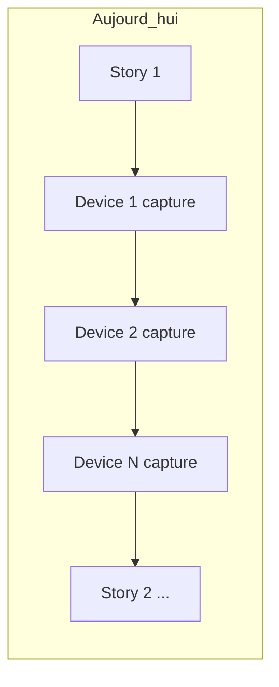
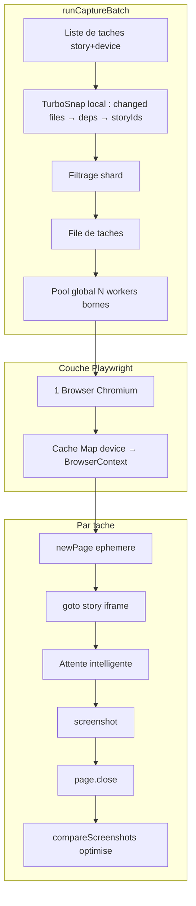
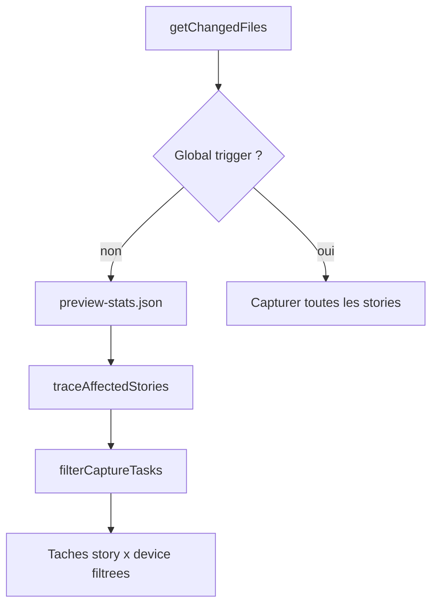
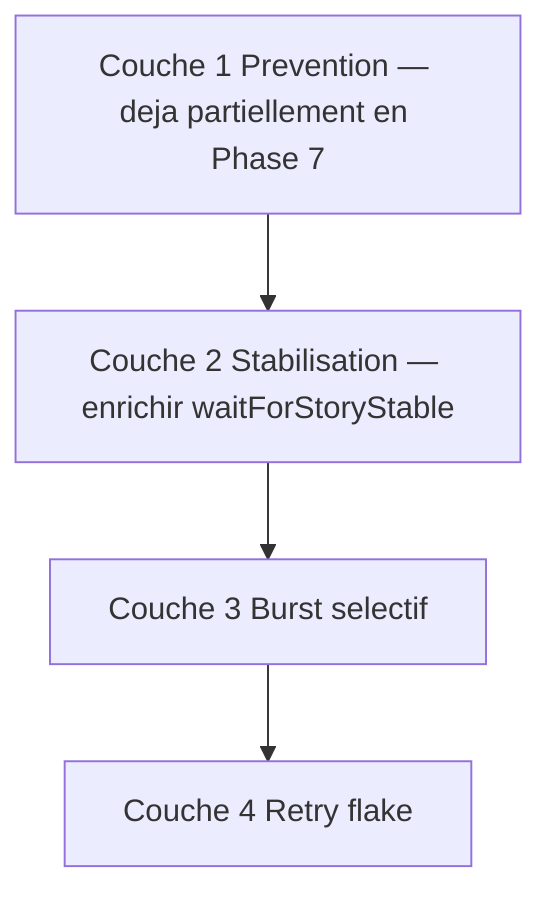
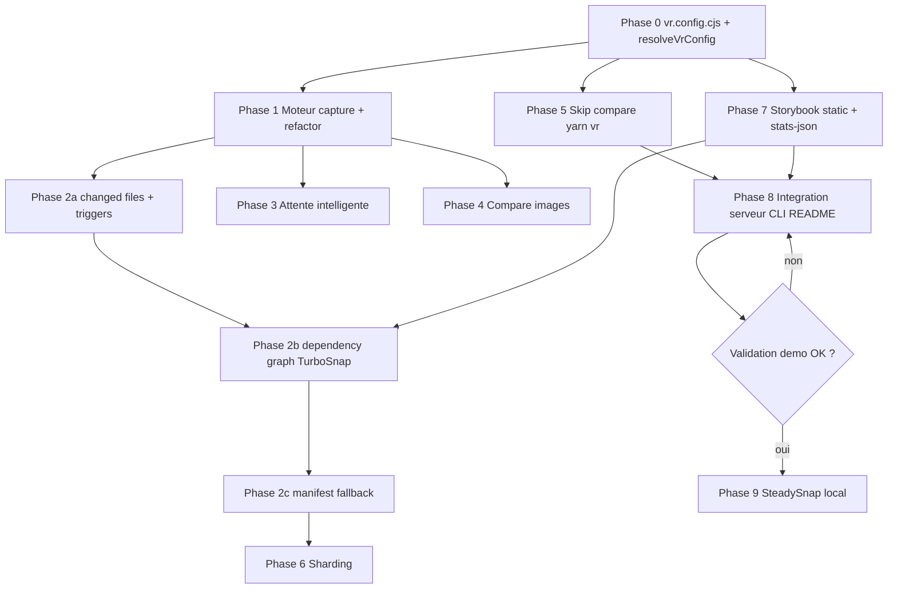

# Plan d'optimisation de la génération VR

## Périmètre

Implémenter **tous les points d'optimisation** de l'analyse précédente, **sauf** :

- Réduire la matrice de devices en dev (point 4 — config hôte, hors scope code)
- Tags `ignore-vr` (point 5 — déjà en place dans `[src/scripts/compare-visual-regressions.ts](src/scripts/compare-visual-regressions.ts)`)

Comportement retenu pour l'incrémental : **mode incrémental par défaut** ; le mode full uniquement via `VR_COMPARE_MODE=full`, `compare.mode: "full"` dans `vr.config.cjs`, ou l'action UI « tout régénérer ».

**Config unifiée** : un seul fichier obligatoire à la racine du projet hôte — `vr.config.cjs` (remplace `vr-devices.config.cjs`). Contient `devices` + paramètres moteur. Les env vars restent des **overrides** ponctuels (CI, session locale).

**Phases 0–8** : implémentation prioritaire — perf, incrémental, config, intégration.  
**Phase 9 (SteadySnap local)** : **après validation** des phases 0–8 sur la demo — anti-flake avancé, sans bloquer la v1.

### Critères de passage Phase 8 → Phase 9

- `yarn vr` + `yarn vr:compare` OK (incrémental + full)
- TurboSnap + parallélisme validés sur la demo
- UI de validation fonctionnelle
- Liste des stories flaky identifiée (si applicable)

---

## État actuel (problème)




- Config actuelle : `vr-devices.config.cjs` exporte un **tableau** de devices uniquement — pas de paramètres moteur centralisés
- Boucle séquentielle `stories × devices` dupliquée dans 4 fonctions : `compareVisualRegressions`, `compareSelectedStories`, `compareAllStories`, `compareByType` (`[src/scripts/compare-visual-regressions.ts](src/scripts/compare-visual-regressions.ts)`)
- Chaque capture : `newContext()` → `goto` → `waitForTimeout(300)` → screenshot → `close()`
- Filtrage incrémental inexistant : chaque run recapture tout ; pas de détection de deps (contrairement à TurboSnap)
- Run complet : `deleteAllVisualRegressionsFiles()` systématique (ligne 1010)
- `yarn vr` lance toujours une comparaison initiale complète (`[src/scripts/vr-launcher.ts](src/scripts/vr-launcher.ts)`)

---

## Architecture cible




---

## Phase 0 — Fichier de config unifié `vr.config.cjs`

Remplacer `vr-devices.config.cjs` par un **seul fichier** `vr.config.cjs` à la racine du projet hôte.

### Format cible

```js
// vr.config.cjs
module.exports = {
  devices: [
    {
      name: "desktop-fhd",
      viewport: { width: 1920, height: 1080 },
      deviceScaleFactor: 1,
      isMobile: false,
      label: "Desktop FHD",
      icon: "laptop",
      color: "newTheme_primary",
    },
    // ...
  ],
  capture: {
    concurrency: 8,       // pool global (défaut : min(cpus, 8))
    maxTestTime: 10_000,  // timeout par capture (ms)
  },
  compare: {
    mode: "incremental",       // "incremental" | "full"
    base: "origin/main",       // ref git pour diff commits (CI)
    includeWorkingTree: true,  // inclure unstaged + staged (défaut true — dev local)
    threshold: 0,
    globalTriggers: [          // changement → run complet (évite faux négatifs)
      ".storybook/**",
      "package.json",
      "yarn.lock",
      "vr.config.cjs",
    ],
    statsFile: "storybook-static/preview-stats.json",  // graphe Webpack TurboSnap
    manifestPath: ".vr-cache/manifest.json",           // fallback hash sans git
  },
  launcher: {
    runInitialCompare: false,  // lancer compare au yarn vr ?
    storybookStatic: false,    // storybook build + serve au lieu de dev
  },
  storybook: {
    url: "http://localhost:6006",  // override URL Storybook
  },
  // Phase 9 — réservé dès la v1 (valeurs par défaut, enrichi après validation)
  stabilize: {
    freezeAnimations: true,   // v1 : freeze CSS simple activé dès Phase 3
    waitNetworkQuietMs: 0,      // Phase 9 : fenêtre réseau quiet (ms)
    waitFonts: true,            // Phase 3
    burstCapture: false,        // Phase 9 : burst désactivé par défaut (perf)
    burstFrames: 3,
    burstIntervalMs: 100,
    flakeRetryThreshold: 50,    // Phase 9 : retry si diff suspect (pixels)
    maxStabilizeTime: 5_000,
  },
};
```

### Hiérarchie de résolution

```
valeur finale = env var (VR_*)  >  vr.config.cjs  >  défauts package
```

| Paramètre | Clé `vr.config.cjs` | Override env | Défaut package |
|---|---|---|---|
| Devices | `devices` | — | (obligatoire) |
| Concurrence | `capture.concurrency` | `VR_CONCURRENCY` | `min(cpus, 8)` |
| Timeout capture | `capture.maxTestTime` | `VR_MAX_TEST_TIME` | `10000` |
| Mode compare | `compare.mode` | `VR_COMPARE_MODE` | `"incremental"` |
| Base git | `compare.base` | `VR_COMPARE_BASE` | `"origin/main"` |
| Working tree | `compare.includeWorkingTree` | — | `true` |
| Global triggers | `compare.globalTriggers` | — | voir défauts ci-dessus |
| Stats Webpack | `compare.statsFile` | — | `storybook-static/preview-stats.json` |
| Manifest hash | `compare.manifestPath` | — | `.vr-cache/manifest.json` |
| Seuil diff | `compare.threshold` | `VR_THRESHOLD` | `0` |
| Compare au lancement | `launcher.runInitialCompare` | `VR_RUN_INITIAL_COMPARE` | `false` |
| Storybook statique | `launcher.storybookStatic` | `VR_STORYBOOK_STATIC` | `false` |
| URL Storybook | `storybook.url` | `VR_STORYBOOK_URL` | `http://localhost:6006` |
| Freeze animations | `stabilize.freezeAnimations` | — | `true` |
| Burst capture | `stabilize.burstCapture` | — | `false` (Phase 9) |
| Shard index/total | — | `VR_SHARD_INDEX` / `VR_SHARD_TOTAL` | — (CI uniquement, pas dans le fichier) |

Les paramètres **CI/session** (`VR_SHARD_*`, `VR_PROJECT_ROOT`) restent **env uniquement** — jamais dans le fichier.

### Nouveau module `resolveVrConfig()`

**Fichier** : [`src/utils/vr-config.ts`](src/utils/vr-config.ts)

```ts
type VrConfig = {
  devices: VRDeviceConfigItem[];
  capture: { concurrency: number; maxTestTime: number };
  compare: {
    mode: "incremental" | "full";
    base: string;
    includeWorkingTree: boolean;
    threshold: number;
    globalTriggers: string[];
    statsFile: string;
    manifestPath: string;
  };
  launcher: { runInitialCompare: boolean; storybookStatic: boolean };
  storybook: { url: string };
  stabilize: {
    freezeAnimations: boolean;
    waitNetworkQuietMs: number;
    waitFonts: boolean;
    burstCapture: boolean;
    burstFrames: number;
    burstIntervalMs: number;
    flakeRetryThreshold: number;
    maxStabilizeTime: number;
  };
};

function loadVrConfig(root: string): VrConfig   // charge vr.config.cjs
function resolveVrConfig(root: string): VrConfig  // merge env > fichier > défauts
```

Remplacer dans [`src/utils/node.ts`](src/utils/node.ts) :
- `VR_DEVICES_CONFIG_FILENAME` → `VR_CONFIG_FILENAME = "vr.config.cjs"`
- `loadVrDevicesConfig()` → `resolveVrConfig().devices` (ou export dédiés)
- Validation : `devices` tableau non vide obligatoire ; autres sections optionnelles avec défauts

### Migration (breaking change documenté)

1. Renommer `vr-devices.config.cjs` → `vr.config.cjs` dans le package demo
2. Envelopper le tableau existant : `module.exports = { devices: [ ... ] }`
3. Mettre à jour toutes les références :
   - [`bin/visual-regression.mjs`](bin/visual-regression.mjs) — vérifie `vr.config.cjs`
   - [`src/utils/node.ts`](src/utils/node.ts), [`src/types/types.ts`](src/types/types.ts)
   - [`src/scripts/vr-server.ts`](src/scripts/vr-server.ts), [`src/VisualRegressions.tsx`](src/VisualRegressions.tsx)
   - [`README.md`](README.md)
4. Message d'erreur explicite si `vr-devices.config.cjs` détecté : *« Renommez en vr.config.cjs et enveloppez les devices dans un objet »*
5. Pas de rétrocompat silencieuse — migration claire, une seule source de vérité

---

## Phase 1 — Refactor du moteur de capture

**Nouveau fichier** : `[src/scripts/vr-capture-engine.ts](src/scripts/vr-capture-engine.ts)`

Extraire la logique commune dans un moteur unique consommé par toutes les entrées de comparaison.

### Types et API

```ts
type CaptureTask = {
  storyId: string;
  deviceName: string;
  componentDir: string;
};

type CaptureBatchOptions = {
  mode: "full" | "incremental";
  wipePublicDir?: boolean;        // true seulement en full explicite
  concurrency?: number;           // défaut : resolveConcurrency() (voir ci-dessous)
  onProgress?: (done: number, total: number) => void;
};

runCaptureBatch(tasks: CaptureTask[], options): Promise<{ success: boolean; stats: CaptureStats }>
```

### Parallélisation optimale : pool global + cache de contextes (points 1 et 2)

**Unité de travail** : une tâche = `(storyId, deviceName)`, pas un device entier.

**Pourquoi pas 1 worker/device ?**
- 1 device → 0 parallélisme sur les stories (tout séquentiel)
- 100 devices → 100 contextes simultanés → risque OOM / crash Chromium

**Modèle retenu :**

1. **1 seul `Browser`** pour tout le run (comme aujourd'hui)
2. **Cache de contextes** : `Map<deviceName, BrowserContext>` — créé à la demande, réutilisé (viewport correct une fois pour toutes)
3. **Pool global borné** via sémaphore : max `N` captures simultanées, indépendant du nombre de devices
4. **Par tâche** (dans un slot du pool) :
   - acquérir un slot du sémaphore
   - `getOrCreateContext(deviceName)` depuis le cache
   - `newPage()` → `goto` → attente → screenshot → `page.close()` (page éphémère, pas réutilisée entre tâches concurrentes)
   - libérer le slot ; dès qu'un slot se libère, la tâche suivante dans la file démarre

Playwright autorise **plusieurs `Page` concurrentes dans le même `BrowserContext`** : sur 1 seul device, `N` stories peuvent être capturées en parallèle.

**Résolution de `N` (concurrence)** — via `resolveVrConfig()` :

```ts
function resolveConcurrency(taskCount: number, config: VrConfig): number {
  const env = Number(process.env.VR_CONCURRENCY);
  const fromFile = config.capture.concurrency;
  const cpuBased = Math.max(2, Math.min(os.cpus().length, 8));
  const requested = Number.isFinite(env) && env > 0 ? env : (fromFile ?? cpuBased);
  const ABSOLUTE_MAX = 16;
  return Math.min(requested, taskCount, ABSOLUTE_MAX);
}
```

| Source | Rôle |
|---|---|
| `vr.config.cjs` → `capture.concurrency` | Défaut d'équipe versionné |
| `VR_CONCURRENCY` (env) | Override ponctuel machine/CI |

**Exemples de comportement :**

| Config | Comportement |
|---|---|
| 1 device, 100 stories, N=8 | 8 captures en parallèle sur le même device, puis les suivantes |
| 100 devices, 10 stories, N=8 | 8 tâches en parallèle réparties sur les devices disponibles |
| 4 devices, 20 stories (80 tâches) | file de 80 tâches drainée par 8 workers continus |

**Cycle de vie des ressources :**

| Ressource | Stratégie | Coût |
|---|---|---|
| `Browser` | 1 pour tout le run | Élevé |
| `BrowserContext` | 1 par device, cache lazy | Moyen |
| `Page` | 1 par tâche, fermée après capture | Faible |

En fin de batch : fermer tous les contextes du cache, puis le browser.

**Pseudo-code du moteur :**

```ts
const concurrency = resolveConcurrency(tasks.length, config);
const contextByDevice = new Map<string, BrowserContext>();
const semaphore = new Semaphore(concurrency);

await Promise.all(tasks.map(task => semaphore.run(async () => {
  const ctx = await getOrCreateContext(browser, task.deviceName, contextByDevice);
  const page = await ctx.newPage();
  try {
    await captureStory(page, task, ...);
    await compareScreenshots(...);
  } finally {
    await page.close();
  }
})));
```

### Refactor des 4 fonctions existantes

`[compare-visual-regressions.ts](src/scripts/compare-visual-regressions.ts)` devient un orchestrateur léger :


| Fonction                   | Changement                                                             |
| -------------------------- | ---------------------------------------------------------------------- |
| `compareVisualRegressions` | Construit tasks → `filterCaptureTasks()` (TurboSnap) → `runCaptureBatch()` |
| `compareSelectedStories`   | Tasks depuis la sélection → batch (toujours full pour la sélection UI) |
| `compareAllStories`        | Tasks complètes → batch full + wipe                                    |
| `compareByType`            | Tasks depuis `deleted/` → batch full ciblé                             |


Supprimer les 4 boucles `for` dupliquées (~200 lignes).

---

## Phase 2 — Mode incrémental type TurboSnap (point 3 + éviter le wipe)

Inspiré de [Chromatic TurboSnap](https://www.chromatic.com/docs/turbosnap/) : détecter les fichiers modifiés, remonter le **graphe de dépendances Webpack**, ne capturer que les stories impactées. Les baselines locales existantes (`src/.../Screenshots/`) jouent le rôle des « TurboSnaps » — pas de recapture = pas de changement.

### Limites de l'approche naïve (git + importPath seul)

| Limite | Exemple |
|---|---|
| `importPath` = fichier story uniquement | Modifier `DemoButton.tsx` sans toucher `.stories.tsx` → skip à tort |
| `git diff HEAD~1` seulement | Modifications non commitées → skip à tort |
| Pas de graphe de deps | Changer un atom partagé → stories dépendantes non recapturées |
| Pas de global triggers | Changer `.storybook/preview.tsx` → aucune recapture |

### Architecture TurboSnap local



### 2a — Détection des fichiers modifiés

**Fichier** : [`src/utils/vr-incremental.ts`](src/utils/vr-incremental.ts)

`getChangedFiles(config)` combine **plusieurs sources** (pas seulement commits) :

```bash
# Commits depuis la base (CI)
git diff --name-only $compare.base...HEAD

# Working tree (dev local — défaut activé via includeWorkingTree)
git diff --name-only HEAD          # unstaged
git diff --name-only --cached      # staged

# Fichiers non suivis pertinents (optionnel, src/**)
git ls-files --others --exclude-standard -- 'src/**'
```

**Fallback sans git** : manifest `.vr-cache/manifest.json` stockant le sha256 de chaque fichier source au dernier run réussi → comparer au run courant. Pas de fallback vers mode full silencieux — log explicite.

`updateManifest()` appelé en fin de run réussi.

### 2b — Graphe de dépendances (cœur TurboSnap)

**Fichier** : [`src/utils/vr-dependency-graph.ts`](src/utils/vr-dependency-graph.ts)

**Source du graphe** : `preview-stats.json` généré au build Storybook (comme Chromatic) :

```bash
storybook build --stats-json
# → storybook-static/preview-stats.json
```

**Algorithme `traceAffectedStories(changedFiles, stats, storyIndex)`** :

1. Charger `preview-stats.json` (chemin depuis `compare.statsFile`)
2. Construire le graphe inverse (module → modules qui l'importent)
3. Pour chaque fichier modifié, remonter les dépendances
4. Filtrer les modules `*.stories.*`
5. Mapper vers `storyId` via `index.json` (`importPath`)

**Exemple** : modifier `src/demo/components/DemoButton.tsx` → graphe remonte vers `DemoButton.stories.tsx` → seules les stories `demo-button--*` sont capturées (× devices).

**Fallback si stats absentes** : `traceViaStaticImports()` — analyse récursive des `import`/`require` TypeScript. Moins précis que Webpack mais sans build préalable. Log : `⚠️ preview-stats.json absent, fallback analyse statique`.

**Cache stats** : ne rebuilder Storybook que si un `globalTrigger` ou absence de fichier stats ; sinon réutiliser le cache existant.

### 2c — Global triggers (éviter faux négatifs)

Si un fichier modifié matche un glob de `compare.globalTriggers` → **run complet** pour ce compare (toutes les stories).

Défauts :

```js
globalTriggers: [
  ".storybook/**",
  "package.json",
  "yarn.lock",
  "vr.config.cjs",
]
```

Configurable dans `vr.config.cjs` (thèmes globaux, tokens, etc.).

### 2d — Règles finales de filtrage

Une tâche `(storyId, device)` est **capturée** si au moins une condition :

| # | Condition |
|---|---|
| 1 | `compare.mode === "full"` ou bouton UI « tout régénérer » |
| 2 | Fichier modifié matche un `globalTrigger` |
| 3 | Story dans le graphe de deps des fichiers modifiés (TurboSnap) |
| 4 | Baseline `src/.../Screenshots/{device}-{storyId}.screenshot.png` absente |
| 5 | Fichier `__new__` / `__diff__` existant dans `public/Screenshots/` |
| 6 | Tag `force-vr` sur la story |

Sinon → **skip** avec log : `⏭️ skipped: {device}-{storyId} (unchanged)`.

`filterCaptureTasks(allTasks, config)` dans `vr-incremental.ts` applique ces règles.

### Wipe conditionnel

- `compare.mode: "incremental"` (défaut) : **ne pas** appeler `deleteAllVisualRegressionsFiles()`
- `compare.mode: "full"` ou `VR_COMPARE_MODE=full` ou global trigger : wipe + recapture tout
- `compareAllStories` (bouton UI) : force `mode: "full"` + wipe

### API publique Phase 2

```ts
// vr-incremental.ts
getChangedFiles(config): Promise<string[]>
isGlobalTrigger(changedFiles, config): boolean
filterCaptureTasks(tasks, config, storyIndex): Promise<CaptureTask[]>
updateManifest(changedFiles): Promise<void>

// vr-dependency-graph.ts
loadPreviewStats(statsFilePath): DependencyGraph
traceAffectedStories(changedFiles, graph, storyIndex): Set<string>  // storyIds
traceViaStaticImports(changedFiles, storyIndex): Set<string>       // fallback
```

### Ordre d'implémentation Phase 2

1. `getChangedFiles` + working tree + global triggers (fiabilité dev)
2. `vr-dependency-graph` via `preview-stats.json` (perf TurboSnap)
3. Manifest hash fallback (robustesse sans git)

### Scénarios couverts

| Scénario | Résultat |
|---|---|
| Commit puis compare (CI) | Diff base...HEAD + graphe deps |
| Modifie sans commit (dev) | Working tree inclus (`includeWorkingTree: true`) |
| Modifie composant, pas le .stories | Graphe deps remonte vers les stories |
| Première install / pas de baseline | Capture tout (règle #4) |
| Change `.storybook/preview.tsx` | Global trigger → capture tout |
| Pas de git | Manifest hash ; si absent → warn + full |
| Veut tout refaire | `VR_COMPARE_MODE=full` ou bouton UI |


---

## Phase 3 — Attente intelligente v1 (point 6)

**Point d'extension unique** pour la capture : `waitForStoryStable(page, config)` dans le moteur — Phase 9 enrichira ce hook sans retoucher le pipeline.

Dans [`src/scripts/vr-capture-engine.ts`](src/scripts/vr-capture-engine.ts) :

1. Remplacer `waitForTimeout(300)` par `waitForStoryStable()` :
   - `await page.waitForSelector("#storybook-root >> visible=true")`
   - si `stabilize.waitFonts` : `await page.waitForFunction(() => document.fonts?.ready)`
   - `await page.waitForFunction(() => document.querySelector("#storybook-root")?.children.length > 0)`
   - si `stabilize.freezeAnimations` : injection CSS freeze (animations/transitions → 0s) — pilier SteadySnap léger
2. Timeout global : `resolveVrConfig().capture.maxTestTime` (défaut 10s, override `VR_MAX_TEST_TIME`)
3. Optionnel : `data-vr-ready` dans [`.storybook/preview.tsx`](.storybook/preview.tsx) pour stories lourdes (documenté README)

**Hors scope Phase 3** (reporté Phase 9) : network quiet, burst capture, retry flake, flag RN/Reanimated.

---

## Phase 4 — Optimisation de la comparaison d'images

Dans `compareScreenshots` (déplacé dans `[src/scripts/vr-capture-engine.ts](src/scripts/vr-capture-engine.ts)`) :

1. **Early exit taille** : si `img1.width/height !== img2.width/height` → diff direct (déjà partiellement fait)
2. **Comparaison buffer rapide** : si les buffers PNG bruts sont identiques → skip `pixelmatch` (log `✅ No visual regression`)
3. Conserver `pixelmatch` uniquement pour les cas ambigus (buffers différents, même taille)

Gain : la majorité des runs incrémentaux n'ont que quelques vraies diffs à analyser pixel par pixel.

---

## Phase 5 — Skip comparaison initiale au `yarn vr` (point 7)

Modifier [`src/scripts/vr-launcher.ts`](src/scripts/vr-launcher.ts) :

- Lire `resolveVrConfig().launcher.runInitialCompare` (défaut `false`)
- Override env : `VR_RUN_INITIAL_COMPARE=1` force la comparaison initiale
- Par défaut : **ne plus lancer** `compare-visual-regressions.ts` au démarrage
- Après le skip : appeler quand même `POST /regressions/rebuild` pour indexer les screenshots existants
- Log clair : `Comparaison initiale ignorée (launcher.runInitialCompare ou VR_RUN_INITIAL_COMPARE=1 pour forcer)`

Mettre à jour `[bin/visual-regression.mjs](bin/visual-regression.mjs)` commentaires + `[README.md](README.md)`.

Workflow dev recommandé documenté :

```
yarn vr          → infra seule (serveur + Storybook + app)
yarn vr:compare  → comparaison incrémentale à la demande
```

---

## Phase 6 — Sharding CI

Dans `[src/utils/vr-incremental.ts](src/utils/vr-incremental.ts)` ou le moteur :

- Variables : `VR_SHARD_INDEX` (0-based) et `VR_SHARD_TOTAL`
- Filtrer les tasks : `hash(storyId) % VR_SHARD_TOTAL === VR_SHARD_INDEX`
- Log : `Shard 2/4 : 45/180 tasks`
- Documenter usage CI dans README :

```bash
VR_SHARD_INDEX=0 VR_SHARD_TOTAL=4 yarn vr:compare
```

---

## Phase 7 — Storybook statique + stats TurboSnap + blocage réseau

### Storybook statique et graphe de dépendances

- Script package : `vr:storybook:static` → `storybook build --stats-json` + `npx serve storybook-static -l 6006`
- Génère `storybook-static/preview-stats.json` utilisé par Phase 2 (`vr-dependency-graph.ts`)
- URL : `resolveVrConfig().storybook.url` (override `VR_STORYBOOK_URL`)
- Launcher : si `launcher.storybookStatic` ou `VR_STORYBOOK_STATIC=1`, build statique + serve au lieu de `storybook dev`
- Rebuild stats uniquement si absents ou si un `globalTrigger` a changé depuis le dernier build

### Blocage réseau Playwright

Dans le moteur, au setup de chaque context :

```ts
await context.route("**/*", route => {
  const url = route.request().url();
  if (url.startsWith(STORYBOOK_URL) || url.startsWith("data:")) route.continue();
  else route.abort();
});
```

Réduit les latences sur stories avec appels externes (analytics, fonts CDN, etc.).

---

## Phase 8 — Intégration serveur, constantes et CLI

### [`src/utils/vr-config.ts`](src/utils/vr-config.ts) (nouveau)

- `loadVrConfig()`, `resolveVrConfig()`, types `VrConfig`
- Point d'entrée unique pour toute la config projet

### [`src/constants/constants.ts`](src/constants/constants.ts)

- `STORYBOOK_URL` dérivé de `resolveVrConfig()` (plus de constante hardcodée seule)
- Documenter les env vars override dans les commentaires

### [`src/scripts/vr-server.ts`](src/scripts/vr-server.ts)

- Charger devices via `resolveVrConfig().devices`
- `GET /regressions/config/devices` : inchangé côté UI (retourne `devices`)
- `POST /compare/all-stories` : passe explicitement `mode: "full"` au moteur
- `POST /compare/selected` : passe `mode: "full"` (régénération volontaire)

### [`bin/visual-regression.mjs`](bin/visual-regression.mjs)

- Vérifier présence de `vr.config.cjs` (plus `vr-devices.config.cjs`)
- Message d'aide migration si ancien fichier détecté

### [`src/scripts/vr-launcher.ts`](src/scripts/vr-launcher.ts)

- Skip compare selon `launcher.runInitialCompare` (phase 5)
- Storybook statique selon `launcher.storybookStatic`

---

## Phase 9 — SteadySnap local (post-validation, anti-flake)

**Prérequis** : phases 0–8 validées sur la demo (voir critères ci-dessus).  
**Inspiré de** [Chromatic SteadySnap](https://www.chromatic.com/blog/steadysnap/) — équivalent self-hosted, optimisé perf (pas de burst systématique).

### Objectif

Éliminer les instabilités de capture (animations, chargement, timing) sans multiplier le coût de chaque screenshot.

### Architecture en couches (ordre de priorité)



| Couche | Contenu | Phase |
|---|---|---|
| Prévention | Storybook statique, blocage réseau externe, freeze CSS | 3 + 7 |
| Stabilisation | network quiet, images loaded, `data-vr-ready` | **9a** |
| Burst | N frames + sélection consensus | **9b** (opt-in) |
| Retry | recapture si diff < seuil flake | **9c** |

### 9a — Enrichir `waitForStoryStable()`

**Fichier** : [`src/utils/vr-steadysnap.ts`](src/utils/vr-steadysnap.ts)

- **Network quiet** : tracker requêtes actives via `page.on('request'/'requestfinished')` ; attendre `waitNetworkQuietMs` sans activité
- **Images loaded** : toutes les `img` ont `complete === true`
- Conserver fonts + `#storybook-root` (Phase 3)
- Plafond : `stabilize.maxStabilizeTime`

### 9b — Freeze frame avancé

- Pause `video` (`pause()`, `currentTime = 0`)
- Flag `VR_CAPTURE=1` / `window.__VR_CAPTURE__` dans [`.storybook/preview.tsx`](.storybook/preview.tsx) :
  - désactiver Reanimated / modales animées (`animationType="fade"`) en mode capture
  - pattern équivalent `isChromatic` côté stories hôte

Tag story optionnel : `burst-vr` pour forcer burst sur une story flaky.

### 9c — Burst capture sélectif (pas par défaut)

`stabilize.burstCapture: false` par défaut — **ne pas** activer globalement (coût × N frames).

Activation :
- globalement via `vr.config.cjs` si besoin
- par story via tag `burst-vr`
- **retry automatique** : si comparaison échoue avec diff < `flakeRetryThreshold` pixels → 1 recapture avec burst avant de déclarer VR

Algorithme burst :
1. N screenshots espacés de `burstIntervalMs`
2. Comparer pixel à pixel entre frames
3. Choisir la frame consensus (ou 2 frames consécutives identiques)

### API

```ts
// vr-steadysnap.ts
waitForStoryStable(page, config): Promise<void>  // remplace/enrichit Phase 3
freezeDynamicContent(page, config): Promise<void>
captureWithBurst(page, locator, config): Promise<Buffer>  // si burst activé
shouldRetryFlake(diffPixels, config): boolean
```

### Validation Phase 9

- Stories avec modales/animations : 3 runs consécutifs sans diff flake
- Burst activé sur 1 story taguée : frame stable sélectionnée
- Diff < 50 px → retry → stable ou VR confirmée
- Perf : run incrémental sans burst inchangé vs Phase 8

---

## Ordre d'implémentation




---

## Validation (Phases 0–8 — v1)

1. **Demo package** : 3 stories × 4 devices
   - Run incrémental sans changement → quasi instantané (0 capture)
   - Modifier `DemoButton.tsx` **sans** toucher `.stories.tsx` → capture uniquement les stories Demo/Button × 4 devices (graphe deps)
   - Modifier sans commit → working tree détecté, stories capturées
   - Modifier `.storybook/preview.tsx` → global trigger → capture tout
   - `VR_COMPARE_MODE=full` → recapture tout
2. **Parallélisme** : logs montrent jusqu'à `VR_CONCURRENCY` captures simultanées (défaut ~8) ; temps total nettement inférieur au séquentiel ; avec 1 device et 12 tâches, plusieurs stories capturées en parallèle sur le même contexte
3. **`yarn vr`** : démarre sans compare ; UI charge l'index existant
4. **Sharding** : `VR_SHARD_INDEX=0 VR_SHARD_TOTAL=2` → ~50% des tasks
5. **Régression** : `compareSelectedStories` et `compareByType` fonctionnent via l'UI
6. **Config** : `vr.config.cjs` chargé correctement ; `VR_CONCURRENCY=2` override `capture.concurrency: 8` ; message clair si `vr-devices.config.cjs` encore présent
7. **TurboSnap** : `preview-stats.json` présent → trace correcte ; absent → fallback statique avec warning ; manifest mis à jour post-run

## Validation (Phase 9 — après v1)

8. **SteadySnap** : 3 runs consécutifs sans flake sur stories animées ; burst opt-in ; retry flake sur diffs < seuil

---

## Fichiers principaux touchés


| Fichier | Action |
|---|---|
| [`vr.config.cjs`](vr.config.cjs) | **Créer** — remplace `vr-devices.config.cjs` (devices + paramètres moteur) |
| [`src/utils/vr-config.ts`](src/utils/vr-config.ts) | **Créer** — `loadVrConfig()` + `resolveVrConfig()` |
| [`src/scripts/vr-capture-engine.ts`](src/scripts/vr-capture-engine.ts) | **Créer** — moteur capture/compare |
| [`src/utils/vr-incremental.ts`](src/utils/vr-incremental.ts) | **Créer** — changed files, global triggers, filterCaptureTasks, manifest |
| [`src/utils/vr-dependency-graph.ts`](src/utils/vr-dependency-graph.ts) | **Créer** — TurboSnap via preview-stats.json + fallback imports statiques |
| [`.vr-cache/manifest.json`](.vr-cache/manifest.json) | **Généré** — hashes fichiers pour fallback sans git |
| [`storybook-static/preview-stats.json`](storybook-static/preview-stats.json) | **Généré** — graphe Webpack au build Storybook |
| [`src/scripts/compare-visual-regressions.ts`](src/scripts/compare-visual-regressions.ts) | **Refactor** — délègue au moteur |
| [`src/utils/node.ts`](src/utils/node.ts) | Migrer chargement config vers `vr-config.ts` |
| [`src/types/types.ts`](src/types/types.ts) | Types `VrConfig`, mise à jour commentaires |
| [`bin/visual-regression.mjs`](bin/visual-regression.mjs) | Vérifie `vr.config.cjs` |
| [`src/scripts/vr-launcher.ts`](src/scripts/vr-launcher.ts) | Lit `launcher.*` depuis config |
| [`src/constants/constants.ts`](src/constants/constants.ts) | URL Storybook via config résolue |
| [`src/scripts/vr-server.ts`](src/scripts/vr-server.ts) | Devices + modes full explicites |
| [`src/VisualRegressions.tsx`](src/VisualRegressions.tsx) | Message d'aide → `vr.config.cjs` |
| [`README.md`](README.md) | Documenter `vr.config.cjs`, TurboSnap local, hiérarchie env > fichier > défauts, migration |
| [`.gitignore`](.gitignore) | Ajouter `.vr-cache/` (manifest local) |
| [`.storybook/preview.tsx`](.storybook/preview.tsx) | Option `data-vr-ready` (Phase 3) ; flag `VR_CAPTURE` (Phase 9) |
| `vr-devices.config.cjs` | **Supprimer** après migration |
| [`src/utils/vr-steadysnap.ts`](src/utils/vr-steadysnap.ts) | **Créer Phase 9** — stabilisation avancée, burst, retry flake |


