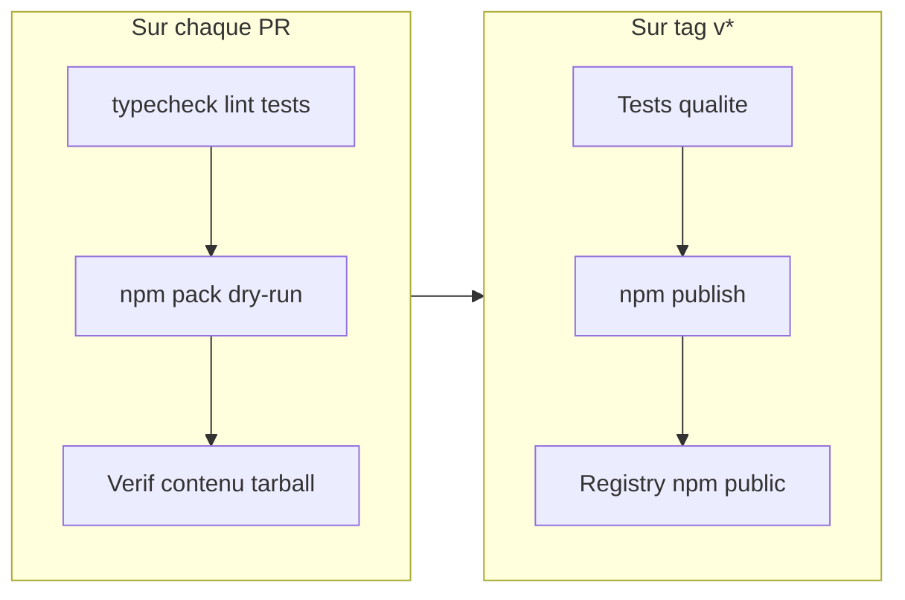

# Plan de publication npm — @setshao/visual-regression

## Contexte

Le package est déjà structuré pour npm (`[package.json](package.json)` : nom scopé, `bin`, `files`, métadonnées, README). Il manque surtout des corrections bloquantes, l'optimisation du tarball, et l'automatisation CI (validation + publish).



---

## 1. Corriger `[package.json](package.json)`

### Point d'entrée API

Bug actuel : `main` / `types` pointent vers `src/index.tsx` (app Expo), alors que l'API publique est dans `[src/index.ts](src/index.ts)`.

```json
"main": "src/index.ts",
"types": "src/index.ts",
"exports": {
  ".": {
    "types": "./src/index.ts",
    "default": "./src/index.ts"
  },
  "./package.json": "./package.json"
}
```

### Dépendances runtime vs dev

Déplacer en `**dependencies**` tout ce que le CLI et l'app Expo consomment à l'exécution chez un projet hôte :

| Package                                                                                    | Raison                                                                                                                                     |
| ------------------------------------------------------------------------------------------ | ------------------------------------------------------------------------------------------------------------------------------------------ |
| `tsx`                                                                                      | Exécution des scripts `.ts` via `[bin/visual-regression.mjs](bin/visual-regression.mjs)`                                                   |
| `playwright`, `pixelmatch`, `pngjs`                                                        | Capture / comparaison (`[src/scripts/vr-capture-engine.ts](src/scripts/vr-capture-engine.ts)`, `[vr-server.ts](src/scripts/vr-server.ts)`) |
| `cross-env`                                                                                | Spawn dans `[vr-launcher.ts](src/scripts/vr-launcher.ts)`                                                                                  |
| `expo`, `expo-font`, `expo-updates`                                                        | App standalone `visual-regression app`                                                                                                     |
| `react-dom`, `react-native-web`, `react-native-safe-area-context`, `react-native-worklets` | Bundling web Expo                                                                                                                          |
| `babel-preset-expo`, `babel-plugin-module-resolver`                                        | Résolution des alias `@atoms`, `@utils`, etc. via `[babel.config.cjs](babel.config.cjs)`                                                   |

Conserver en `**peerDependencies**` (déjà présents) : `react`, `react-native`, `react-native-gesture-handler`, `react-native-reanimated`, `react-native-svg`, `@expo/vector-icons`, `expo-clipboard`.

Laisser en `**devDependencies**` : Storybook, ESLint, Prettier, Vitest, Husky, types, etc.

Après déplacement : `yarn install` pour régénérer `[yarn.lock](yarn.lock)`.

### Métadonnées publication

```json
"publishConfig": {
  "access": "public"
},
"engines": {
  "node": ">=20"
}
```

Ajouter des scripts :

```json
"pack:check": "npm pack --dry-run",
"prepublishOnly": "yarn typecheck && yarn test:ci && npm run pack:check"
```

`prepublishOnly` s'exécute avant `npm publish` (local ou CI).

---

## 2. Fichiers à ajouter ou inclure dans le tarball

### `[LICENSE](LICENSE)` (nouveau)

Fichier MIT standard à la racine (requis par npm et GitHub ; `"license": "MIT"` existe déjà).

### Fichiers de config manquants dans `files`

Actuellement absents du tarball mais **nécessaires à l'exécution** :

| Fichier                                | Rôle                                                  |
| -------------------------------------- | ----------------------------------------------------- |
| `[tsconfig.json](tsconfig.json)`       | Alias TypeScript pour `tsx` (`@utils`, `@scripts`, …) |
| `[babel.config.cjs](babel.config.cjs)` | Alias pour Metro/Expo (`visual-regression app`)       |

Mettre à jour le champ `files` :

```json
"files": [
  "bin",
  "src",
  "docker",
  "app.config.js",
  "metro.config.cjs",
  "babel.config.cjs",
  "tsconfig.json",
  "README.md",
  "LICENSE"
]
```

Retirer `"scripts"` (dossier racine inexistant ; les scripts sont dans `src/scripts/`).

---

## 3. Optimiser le contenu publié — `[.npmignore](.npmignore)` (nouveau)

Le champ `files` inclut tout `src/`, ce qui embarque aujourd'hui ~220 screenshots de démo et 12 fichiers `*.test.ts`. Exclure :

```
src/demo/
**/*.test.ts
.storybook/
storybook-static/
public/
.vr-cache/
*.log
```

La démo reste dans le repo pour `[integration.yml](.github/workflows/integration.yml)` ; elle n'est pas nécessaire chez les consommateurs.

---

## 4. Validation du tarball en CI (chaque PR)

Étendre `[.github/workflows/ci.yml](.github/workflows/ci.yml)` avec une job `pack` :

1. `yarn install --frozen-lockfile`
2. `yarn typecheck && yarn test:ci` (déjà fait dans `quality`)
3. `npm pack --dry-run` et vérifications :

- `src/index.ts` présent, `src/index.tsx` absent ou secondaire
- aucun `src/demo/` ni `*.test.ts`
- `tsconfig.json`, `babel.config.cjs`, `LICENSE` présents
- taille du tarball raisonnable (alerte si > seuil, ex. 5 Mo)

Script utilitaire optionnel : `[scripts/verify-pack.mjs](scripts/verify-pack.mjs)` pour centraliser ces assertions (appelé par CI et localement via `yarn pack:verify`).

---

## 5. Publication automatique sur tag `v*`

Créer `[.github/workflows/npm-publish.yml](.github/workflows/npm-publish.yml)`, aligné sur `[docker-publish.yml](.github/workflows/docker-publish.yml)` :

```yaml
on:
  push:
    tags:
      - "v*"
```

Étapes :

1. Checkout
2. Setup Node 20 + cache yarn
3. `yarn install --frozen-lockfile`
4. `yarn typecheck && yarn test:ci && yarn vr:test-validation --static-only`
5. `npm publish` avec `NODE_AUTH_TOKEN: ${{ secrets.NPM_TOKEN }}`
6. `registry-url: https://registry.npmjs.org` via `actions/setup-node`

**Prérequis manuel (hors repo)** :

- Compte npm avec 2FA activée
- Organisation `@setshao` créée sur npmjs.com
- Secret GitHub `NPM_TOKEN` (token de type "Automation" ou "Publish" avec accès à `@setshao`)

Workflow de release :

```bash
npm version patch   # ou minor/major
git push && git push --tags   # tag v1.0.1 → déclenche npm + docker publish
```

---

## 6. `[CHANGELOG.md](CHANGELOG.md)` (nouveau)

Format [Keep a Changelog](https://keepachangelog.com/) :

```markdown
## [1.0.0] - 2026-07-09

### Added

- Première publication npm de @setshao/visual-regression
- CLI visual-regression (server, compare, app, capture Docker, …)
```

Processus : mettre à jour le CHANGELOG à chaque `npm version`.

---

## 7. Mettre à jour le README

Section « Publier une nouvelle version sur npm » dans `[README.md](README.md)` (l.470+) :

- Corriger la mention `scripts/` (obsolète ; scripts dans `src/scripts/`)
- Documenter le workflow tag `v*` + secret `NPM_TOKEN`
- Ajouter `yarn pack:check` / `yarn pack:verify` avant publication manuelle
- Lister les prérequis npm org `@setshao`
- Mentionner `engines.node >= 20`

---

## 8. Test d'intégration consommateur (avant première publication)

Validation manuelle recommandée après implémentation :

```bash
# Dans visual-regression
npm pack
# Dans un projet hôte
yarn add ../visual-regression/setshao-visual-regression-1.0.0.tgz
npx visual-regression test-validation --static-only
npx visual-regression server   # smoke test CLI
```

Vérifier que les alias `@utils` / `@atoms` se résolvent (tsx + tsconfig + babel).

---

## 9. Première publication (checklist manuelle)

1. Créer org `@setshao` sur npm + ajouter le compte publish
2. `npm login`
3. Merger la PR avec toutes les modifications ci-dessus
4. CI verte (job `pack` incluse)
5. Test local `npm pack` + install tarball dans projet hôte
6. `git tag v1.0.0 && git push origin v1.0.0` → publication auto
7. Vérifier sur [https://www.npmjs.com/package/@setshao/visual-regression](https://www.npmjs.com/package/@setshao/visual-regression)
8. Dans le projet hôte : `yarn add @setshao/visual-regression` (plus de `file:../`)

---

## Fichiers impactés (résumé)

| Fichier                                                                  | Action                                                         |
| ------------------------------------------------------------------------ | -------------------------------------------------------------- |
| `[package.json](package.json)`                                           | Corriger exports, deps, publishConfig, engines, scripts, files |
| `[yarn.lock](yarn.lock)`                                                 | Régénérer après déplacement deps                               |
| `[LICENSE](LICENSE)`                                                     | Créer                                                          |
| `[.npmignore](.npmignore)`                                               | Créer                                                          |
| `[CHANGELOG.md](CHANGELOG.md)`                                           | Créer                                                          |
| `[.github/workflows/ci.yml](.github/workflows/ci.yml)`                   | Ajouter job `pack`                                             |
| `[.github/workflows/npm-publish.yml](.github/workflows/npm-publish.yml)` | Créer                                                          |
| `[scripts/verify-pack.mjs](scripts/verify-pack.mjs)`                     | Créer (optionnel mais recommandé)                              |
| `[README.md](README.md)`                                                 | Mettre à jour section publication                              |

## Risques et mitigations

| Risque                                    | Mitigation                                            |
| ----------------------------------------- | ----------------------------------------------------- |
| Alias TS non résolus chez le consommateur | Publier `tsconfig.json` + test tarball en projet hôte |
| CLI sans `tsx` / `playwright`             | Déplacer en `dependencies`                            |
| Tarball trop lourd                        | `.npmignore` exclut démo + tests                      |
| Package scopé privé par défaut            | `publishConfig.access: "public"`                      |
| Publish sans tests                        | `prepublishOnly` + CI avant `npm publish`             |
